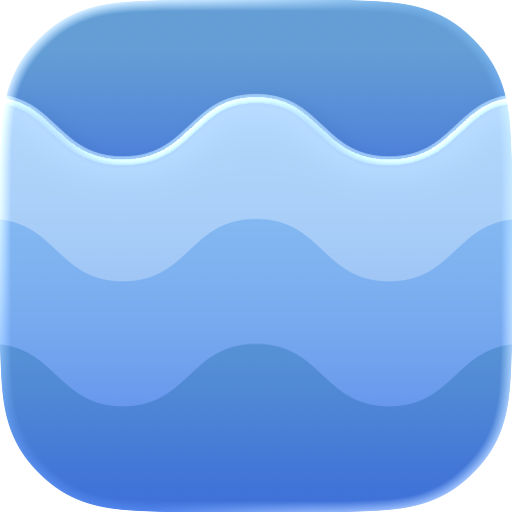
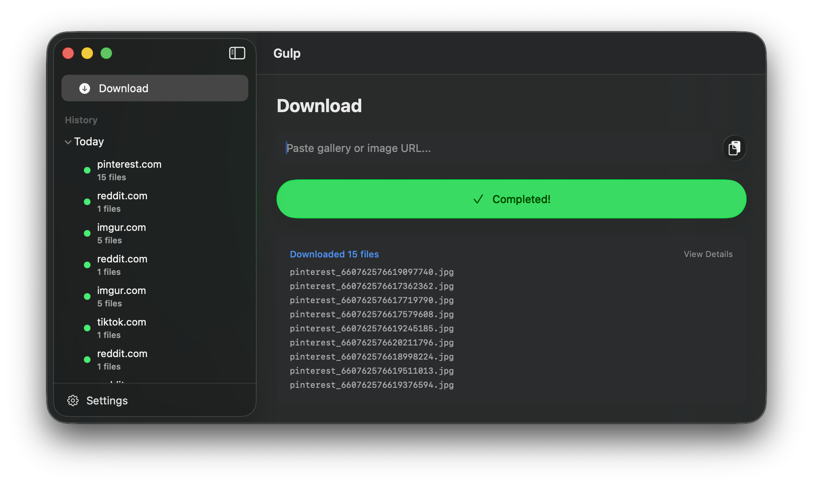

# Gulp

A simple macOS app for [gallery-dl](https://github.com/mikf/gallery-dl) with history and log management.

## Requirements

- macOS 26+
- gallery-dl (`brew install gallery-dl`)

## Features

- Paste a URL and download with one click
- View download history and logs
- Supports all sites that gallery-dl supports 
- App managed instance of gallery-dl's config.json

## Building

Open `Gulp.xcodeproj` in Xcode and build (⌘B).

