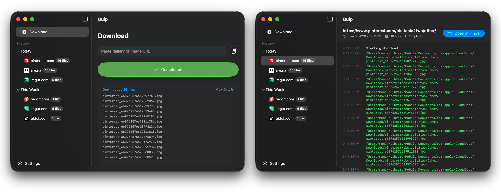

# Gulp

A simple macOS UI wrapper for [gallery-dl](https://github.com/mikf/gallery-dl) with history and log management.

Gallery-DL is a command-line program to download image galleries and collections from several image hosting sites, Gulp builds a simple and managed UI around it for ease of access.



## Installation

### Using Brew
```
brew tap manik/tap https://github.com/mnk400/homebrew-tap
brew install --cask gulp --no-quarantine
```
> **Note:** `--no-quarantine` is required because the app is not notarized as of right now.

### Using Releases
1. Download the latest `.dmg` from [Releases](../../releases)
2. Open the `.dmg` and drag Gulp to Applications
3. Install gallery-dl: `brew install gallery-dl`

> **Note:** The app is not notarized(I do not have an apple developer license), so macOS will show a warning on first launch. Right-click the app and select "Open", then go to System Settings > Privacy & Security > (Scroll Down) Click Open for Gulp or run `xattr -cr /Applications/Gulp.app` in the terminal before opening the app.

### Build from Source
1. Clone the repository
2. Open `Gulp.xcodeproj` in Xcode
3. Build and run (⌘R)

## Requirements

- macOS 26+
- [gallery-dl](https://github.com/mikf/gallery-dl) (`brew install gallery-dl`)

## Features

- Paste a URL and download with one click
- View download history and logs
- Supports all sites that gallery-dl supports
- App managed instance of gallery-dl's config.json

## License

MIT
